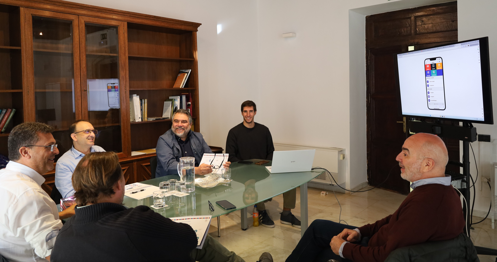

{width="100%"}

La Diputació de València ha presentado la aplicación web CIVIS, una herramienta de modernización digital que busca transformar la relación entre los ciudadanos y la administración local. Esta nueva plataforma será puesta a disposición de los ayuntamientos de la provincia para crear un canal directo y eficiente de comunicación participativa, permitiendo a los vecinos notificar al instante desperfectos, sugerencias o agradecimientos en su entorno municipal.

[Enlace a la noticia completa.](https://www.dival.es/es/sala-premsa/la-diputacion-pone-a-disposicion-de-los-ayuntamientos-una-aplicacion-para-mejorar-la-gestion-de-las-quejas-ciudadanas)
